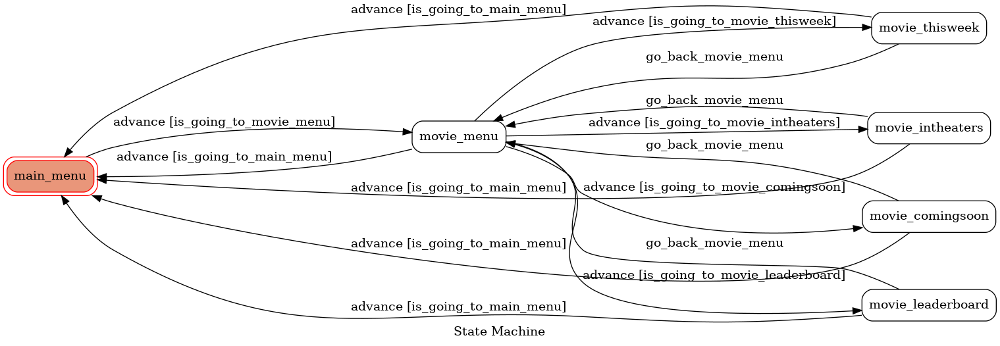

# TOC Project 2021-MovieSearch Linebot

## 功能說明
利用爬蟲從[Yahoo電影](https://movies.yahoo.com.tw/)進行資料抓取，結合Line Chatbot能夠一指操作得到電影相關資訊，目前有本週新片、上映中、排行榜、即將上映四大類，能夠透過不同分類得到有關資訊，未來有機會會繼續擴充功能。
* 本週新片: 電影介紹、預告片、時刻表
* 上映中: 電影介紹、預告片、時刻表
* 排行榜: 台北票房榜、全美票房榜、年度票房榜、預告片榜
* 即將上映: 電影介紹、預告片、劇照

## 使用技術
* Python
* Linebot API
* beautifulsoup4 -> 爬蟲
* Heroku -> deploy
* Rich menu
* Multiple users

## 使用環境
* Python==3.6.9
* Beautifulsoup4==4.10.0

## FSM (有限狀態機)

## Demo

## 注意事項
* 安裝額外插件至Heroku
  1. 把插件及版本加入至 requirement.txt 
  2. 把插件及版本加入至 Pipefile
  3. 執行pipenv去更新 Pipefile.lock
  4. push至Heroku上
* [安裝pygraph至Ubuntu上](https://www.jianshu.com/p/a3da7ecc5303)

## Reference
* [TOC-Project-2020](https://github.com/NCKU-CCS/TOC-Project-2020)
* [LineBot](https://github.com/BClown1229/LineBot)
* [Line richmenu](https://manager.line.biz/account/@973tlgjy/richmenu)
* [Pygraphviz on Heroku](https://hackmd.io/@ccw/B1Xw7E8kN?type=view#Q2-%E5%A6%82%E4%BD%95%E5%9C%A8-Heroku-%E4%BD%BF%E7%94%A8-pygraphviz)
